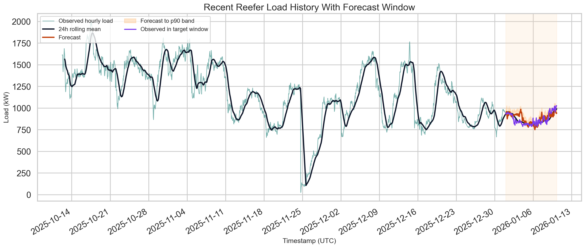
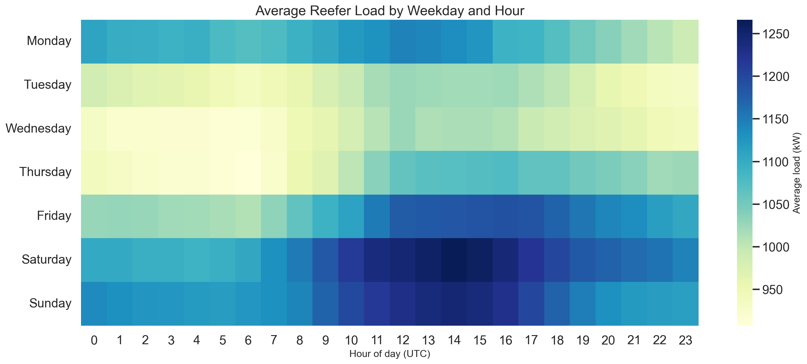
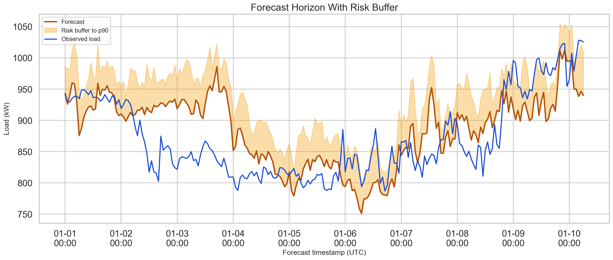

# Reefer Load Forecasting for the Eurogate Challenge

Forecasting hourly electricity demand from refrigerated shipping containers, with special focus on peak-load accuracy and a calibrated upper-risk estimate.

## Overview

This repository contains my solution for the **Reefer Load Outlook Challenge**. The goal is to predict the combined hourly power demand of plugged-in reefer containers and produce:

- `pred_power_kw`: the point forecast
- `pred_p90_kw`: a cautious upper estimate for the same hour

The challenge emphasizes not only average accuracy, but also performance during **high-load hours**, where operational planning matters most.

## Results

The final selected constrained model run produced the following metrics:

| Metric | Value |
| --- | ---: |
| `mae_all` | `45.211` |
| `mae_peak` | `34.340` |
| `pinball_p90` | `7.782` |
| `score` | `34.464` |

Scoring formula used by the challenge:

```text
score = 0.5 * mae_all + 0.3 * mae_peak + 0.2 * pinball_p90
```

Lower is better.

## Approach

The pipeline combines a strong deterministic baseline with a residual learning model:

1. Build an hourly target series using `sum(AvPowerCons) / 1000`.
2. Create leak-safe lag, rolling, calendar, weather, and fleet-composition features.
3. Use a baseline forecast of `0.7 * lag_24 + 0.3 * lag_168`.
4. Train a `GradientBoostingRegressor` to learn the residual on top of that baseline.
5. Calibrate `pred_p90_kw` from positive validation residuals by hour-of-day and prediction bin.

Applied modeling constraints:

- Model fitting uses only labeled rows from `2025-01-01` to `2025-12-31`
- Weather features are treated as a 24-hour-ahead problem, so only weather known at least 24 hours earlier is used

This setup keeps the model simple, reproducible, and well aligned with the challenge objective of handling both normal and peak demand behavior.

## Feature Highlights

The model uses a blend of operational, temporal, and environmental signals:

- Lagged load values at 24h, 48h, 72h, and 168h
- Rolling statistics computed strictly from past data
- Calendar features such as hour-of-day, weekday, month, and cyclical encodings
- Lagged reefer fleet summaries, including container mix and temperature summaries
- Lagged weather summaries, including temperature, wind, and wind-direction features

## Preprocessing

The model uses a simple leak-safe preprocessing pipeline fitted on the training data only:

- Replace `inf` and `-inf` with missing values
- Fill missing feature values with the training median
- Clip extreme values at the 0.5th and 99.5th percentiles
- Standardize non-binary numeric features

Before preprocessing, the raw data is also cleaned and aggregated to hourly level, including timestamp flooring, missing-category handling, and sine/cosine encoding for wind direction.

## Validation Strategy

Model quality is evaluated with rolling 7-day backtests using the competition metrics:

- `mae_all`
- `mae_peak`
- `pinball_p90`
- combined score

The training flow also includes:

- median imputation
- clipping of extreme values
- standardization of non-binary numeric features
- selection and export of the best-performing fold model

## Repository Structure

```text
.
├── README.md
├── approach.md
├── build_features.py
├── train_and_predict.py
├── pipeline/
│   └── reefer_pipeline.py
├── outputs/
│   ├── backtest_metrics.json
│   ├── best_model.pkl
│   ├── hourly_feature_table.csv
│   ├── model_ready_feature_table.csv
│   ├── preprocessing_summary.json
│   └── business_analytics/
└── predictions.csv
```

## How To Run

Install the required Python packages:

```bash
pip install numpy pandas scikit-learn
```

Build the canonical feature table:

```bash
python3 build_features.py --root .
```

Train the model, run backtests, and generate the final submission:

```bash
python3 train_and_predict.py --root .
```

Main generated artifacts:

- `predictions.csv`
- `outputs/backtest_metrics.json`
- `outputs/best_model.pkl`
- `outputs/hourly_feature_table.csv`
- `outputs/model_ready_feature_table.csv`
- `outputs/preprocessing_summary.json`

## Visual Preview

The repository also includes a business-facing analytics pack under `outputs/business_analytics/`.

### Load History And Forecast



### Weekday-Hour Heatmap



### Forecast Risk Band



## Notes

- The solution is designed to be rerunnable on the organizer's hidden target timestamps.
- `pred_p90_kw` is intentionally calibrated to be more informative than a fixed percentage uplift.
- The code prioritizes leak-safe feature construction to respect the 24-hour-ahead forecasting setup.

## Deliverables

This repository includes the required competition deliverables:

- `predictions.csv`
- `approach.md`
- full reproducible source code

## License

This project is released under the [MIT License](LICENSE).
